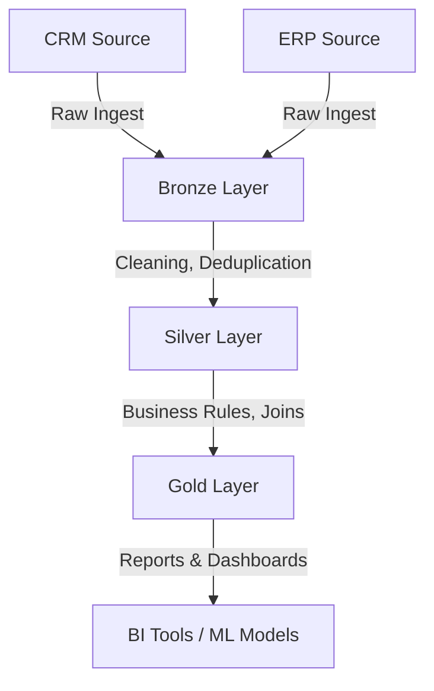

# sql-data-warehouse-project
Building a modern data warehouse with SQL server . including ETL processes , data modeling and analytics . 
# SQL Data Warehouse Project

Got it ✅
Here’s the updated **Markdown file** with **MIT License section** and an **About Me** section (as a learning Data Analyst & Data Scientist):

---

# 📊 Data Warehouse Project (Medallion Architecture)

## 🏗 Overview

This project implements a **Data Warehouse** using the **Medallion Architecture (Bronze → Silver → Gold)**.
We integrate two primary datasets:

* **CRM Dataset** → Customer relationship data (leads, interactions, support tickets).
* **ERP Dataset** → Enterprise resource planning data (orders, inventory, finance, suppliers).

The goal is to transform raw data into **clean, enriched, and analytics-ready datasets** for business reporting and advanced analytics.

---

## 🔷 1. Bronze Layer (Raw Data)

The **Bronze Layer** stores **raw, unprocessed data** directly ingested from source systems.

* **Purpose:**

  * Keep an immutable copy of source data.
  * Serve as the "single source of truth."
  * Allow reprocessing if needed.

* **Data Sources:**

  * **CRM:** Customer profiles, interactions, sales leads, support tickets.
  * **ERP:** Transactions, inventory movements, purchase orders, payments.

* **Storage Format:**

  * Typically in **parquet/CSV/json** format in data lake.
  * Partitioned by ingestion date.

* **Example Tables:**

  * `bronze.crm_customers_raw`
  * `bronze.crm_interactions_raw`
  * `bronze.erp_orders_raw`
  * `bronze.erp_inventory_raw`

---

## 🔶 2. Silver Layer (Cleaned & Standardized Data)

The **Silver Layer** contains **cleaned, structured, and joined data**.

* **Purpose:**

  * Apply **data quality checks** (null handling, duplicates, formatting).
  * Create **conformed dimensions** (standard IDs across CRM & ERP).
  * Integrate data sources for consistency.

* **Transformations Applied:**

  * Remove duplicates & invalid records.
  * Standardize **customer IDs** across CRM & ERP.
  * Normalize date & time formats.
  * Apply business rules (e.g., map ERP orders to CRM customers).

* **Example Tables:**

  * `silver.customers` → Unified view of CRM + ERP customers.
  * `silver.orders` → Cleaned order transactions.
  * `silver.inventory` → Standardized stock & movement records.
  * `silver.interactions` → Customer interaction history.

---

## 🟡 3. Gold Layer (Business Aggregates & Analytics)

The **Gold Layer** contains **business-level curated datasets** for reporting, dashboards, and ML models.

* **Purpose:**

  * Provide **domain-specific aggregated tables**.
  * Serve as inputs to BI tools (Power BI, Tableau, Looker).
  * Enable **KPI tracking**.

* **Example Business Aggregates:**

  * `gold.customer_360` → Complete customer profile with ERP orders + CRM interactions.
  * `gold.sales_summary` → Revenue by region, product, time.
  * `gold.inventory_health` → Stock levels, reorder alerts, supplier performance.
  * `gold.support_performance` → Ticket resolution times, customer satisfaction trends.

* **Use Cases:**

  * **CRM + ERP Integration** → See full customer journey (lead → order → support).
  * **Finance & Sales Analytics** → Revenue forecasting, churn prediction.
  * **Operations Optimization** → Inventory management, supplier analysis.

---

## 📈 Data Flow Summary



---

## ✅ Benefits of Medallion Architecture in this Project

* **Scalability:** Separate layers allow easy expansion of sources.
* **Data Quality:** Errors fixed in Silver ensure reliable Gold data.
* **Flexibility:** Analysts can query Bronze for raw exploration or Gold for insights.
* **Auditability:** Bronze acts as a backup for reprocessing.

---

## 👨‍💻 About Me

Hi, I’m a **learning Data Analyst and aspiring Data Scientist**.

* I enjoy working with **SQL, Python, and Data Warehousing concepts**.
* My focus is on **building scalable data pipelines, analytics solutions, and dashboards**.
* This project is part of my journey to **master data engineering + analytics** and apply these skills in real-world business cases.

---

## 📜 License (MIT)

```
MIT License

Copyright (c) 2025 

Permission is hereby granted, free of charge, to any person obtaining a copy
of this software and associated documentation files (the "Software"), to deal
in the Software without restriction, including without limitation the rights
to use, copy, modify, merge, publish, distribute, sublicense, and/or sell
copies of the Software, and to permit persons to whom the Software is
furnished to do so, subject to the following conditions:

The above copyright notice and this permission notice shall be included in all
copies or substantial portions of the Software.

THE SOFTWARE IS PROVIDED "AS IS", WITHOUT WARRANTY OF ANY KIND, EXPRESS OR
IMPLIED, INCLUDING BUT NOT LIMITED TO THE WARRANTIES OF MERCHANTABILITY,
FITNESS FOR A PARTICULAR PURPOSE AND NONINFRINGEMENT. IN NO EVENT SHALL THE
AUTHORS OR COPYRIGHT HOLDERS BE LIABLE FOR ANY CLAIM, DAMAGES OR OTHER
LIABILITY, WHETHER IN AN ACTION OF CONTRACT, TORT OR OTHERWISE, ARISING FROM,
OUT OF OR IN CONNECTION WITH THE SOFTWARE OR THE USE OR OTHER DEALINGS IN THE
SOFTWARE.
```


---


